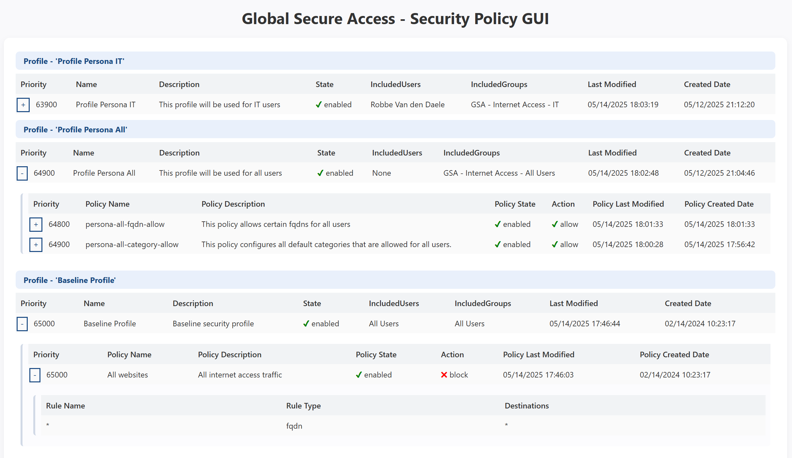

# GlobalSecureAccess-UI-Toolkit

This repository hosts specific UI's that can be used to visualize Global Secure Access policies. It tries to give a visual presentation of the policies in a way like traditional network vendors do. 

# Security Policy GUI

The first GUI we created is the filtering policy GUI. This GUI provides insights in the Global Secure Access Internet Access filtering policies, in a way traditional network security vendors do. The GUI generates a table for each filtering profile, and includes nested tables for each filtering policy within that profile. You can see details like priority, name, description, included users and groups (via related conditional access policies), status, and more. By sorting the priotiy in decending order, you can easily see which policies and profiles take precedence. 



To generate this GUI, two steps are needed as explained below.

## Generate the Security Policy JSON

The GUI is based on a custom made JSON file. This JSON file combines the security profiles with their related user, groups, policies and destinations. The JSON file is automatically saved under the outputs/json directory. Use the command below to generate the JSON file.

### Command Usage

```PowerShell
.\generate-gsa-filterpolicy-map.ps1 -JsonFileName <JSON File Name>
```

### Command Example

```PowerShell
.\generate-gsa-filterpolicy-map.ps1 -JsonFileName filter-policy.json
```

## Generate the Security Policy GUI

Once you generated the Security Policy JSON file, you can generate the HTML GUI. For this, you need the filename of the JSON file and the name you want to give to the HTML file.

### Command Usage

```PowerShell
.\generate-gsa-filterpolicy-gui.ps1 -JsonFileName <JSON File Name> -HtmlFileName <HTML File Name>
```

### Command Example

```PowerShell
.\generate-gsa-filterpolicy-gui.ps1 -JsonFileName filter-policy.json -HtmlFileName filter-policy.html
```

# Contribution guidelines

I would love to see people contribute on this project! If you want to add something to the project, feel free to create a pull request. If you have an idea for a feature or found a bug, feel free to open een issue.